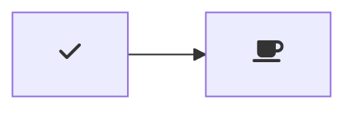

# D3fend Editor

[](https://marketplace.visualstudio.com/items?itemName=ioggstream.d3fend-editor)

Adds D3fend editing support to the Markdown preview for Mermaid diagrams https://github.com/mjbvz/vscode-markdown-mermaid.

D3fend entities are rendered as fontawesome or unicode icons according to the map defined in [this d3fend-mermaid datafile](https://github.com/ioggstream/d3fend-mermaid/blob/10.8.637/packages/mermaid/src/dagre-wrapper/d3fendData.js).

Icons contain a tooltip with the D3fend entity name
and an hyperlink to the D3fend website.

Currently supports Mermaid version 10.8.0.

## Usage

For basic usage instructions, see the [markdown-mermaid](https://github.com/mjbvz/vscode-markdown-mermaid) extension.

Create diagrams in markdown using `mermaid` fenced code blocks:

~~~markdown
```mermaid
graph TD;

    u((User d3f:User))
    api[REST API d3f:WebServerApplication]
    database[MySQL d3f:Database]
    u -->|d3f:WebResourceAccess| --> api
    api -->|d3f:writes| database
```
~~~

Further examples are in [docs](./docs).

## Configuration

- `markdown-mermaid.lightModeTheme` — Configures the Mermaid theme used when VS Code is using a light color theme. Supported values are: `"base"`, `"forest"`, `"dark"`, `"default"`, `"neutral"`. Currently not supported in notebooks.

- `markdown-mermaid.darkModeTheme` — Configures the Mermaid theme used when VS Code is using a dark color theme. Supported values are: `"base"`, `"forest"`, `"dark"`, `"default"`, `"neutral"`. Currently not supported in notebooks.

- `markdown-mermaid.languages` — Configures language ids for Mermaid code blocks. The default is `["mermaid"]`.

### Using custom CSS in the Markdown Preview

You can use the built-in functionality to add custom CSS. More info can be found in the [markdown.styles documentation](https://code.visualstudio.com/Docs/languages/markdown#_using-your-own-css)

For example, add Font Awesome like this:

```
"markdown.styles": [
    "https://use.fontawesome.com/releases/v5.7.1/css/all.css"
]
```

Use it like this:

~~~markdown

~~~
