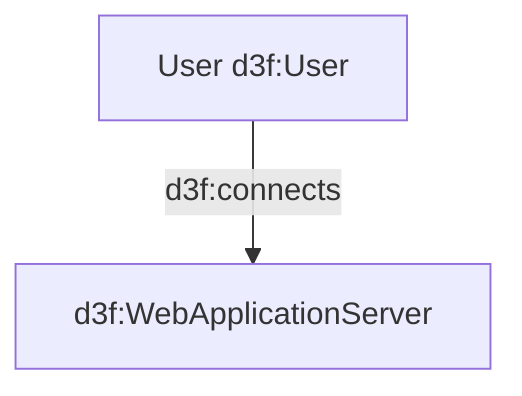
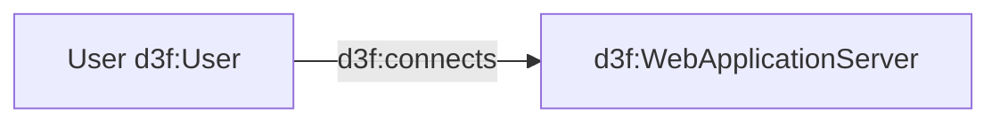
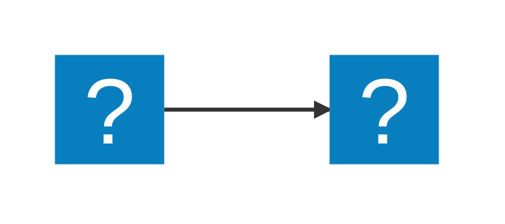
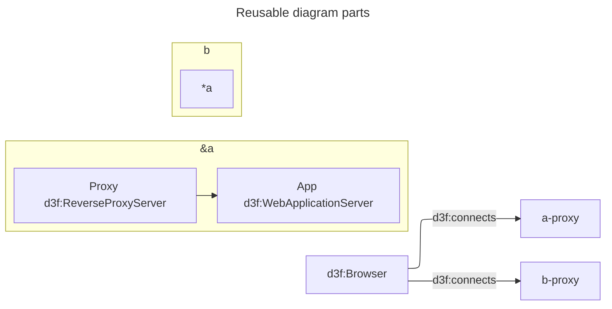
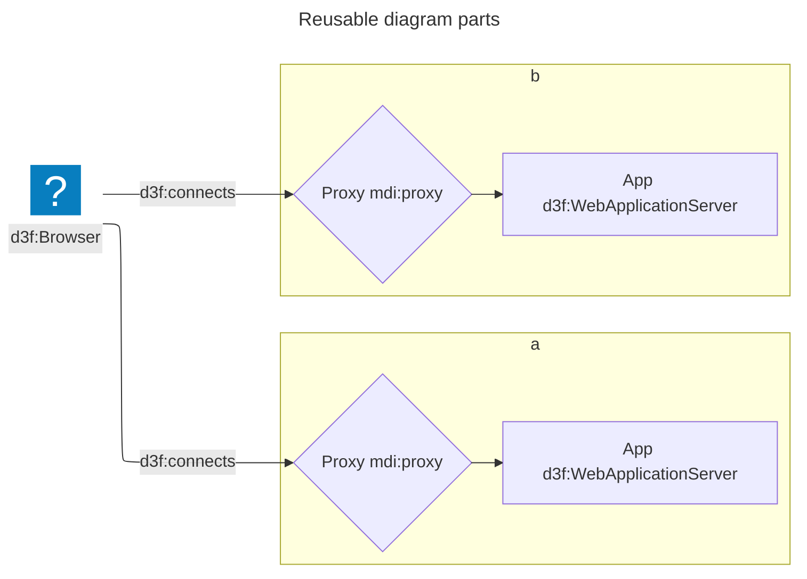

# D3FEND Editor

**Note:** This is a **community fork** of [Markdown Preview Mermaid Support](https://marketplace.visualstudio.com/items?itemName=bierner.markdown-mermaid) that **adds D3FEND-specific features** for security architecture documentation.

## What is D3FEND Editor?

D3FEND Editor extends Mermaid diagram support in VS Code's markdown preview with specialized features for creating architectural diagrams annotated with [D3FEND](https://d3fend.mitre.org/) defensive framework artifacts.

**Key Distinguishing Features:**

- 🛡️ **D3FEND Artifact Labeling** — Annotate diagrams with MITRE D3FEND defensive categories and techniques
- 🏗️ **Architecture Diagrams** — Create security architecture visualizations with D3FEND labels
- 🔗 **Seamless Integration** — Works with Markdown Preview Mermaid's navigation and styling
- 📊 **Full Mermaid Support** — All Mermaid diagram types plus D3FEND annotations
- 🎨 **Icon Support and Anchors** — More icon support and anchor-like mechanism to reuse diagram parts

Current Markdown Mermaid version: 1.31.
Current Mermaid version: 11.11.637 (includes Mermaid 11.11.0 plus D3FEND-specific extensions).

Supports the following iconsets:
- [MDI](https://icon-sets.iconify.design/mdi/)
- [Logos](https://icon-sets.iconify.design/logos/)

## Usage

D3FEND Editor extends Markdown Preview Mermaid with D3FEND support,
allowing you to create diagrams annotated with D3FEND artifacts.
From these diagrams, you can generate RDF graphs representing
your architecture and its security properties.

Configuration options are the same of Markdown Preview Mermaid,
so you can check them on the [original website](https://github.com/mjbvz/vscode-markdown-mermaid).

### Basic D3FEND Diagram

~~~markdown

```mermaid
graph
    
    u[User d3f:User] -->|d3f:connects| webapp[d3f:WebApplicationServer]
    
```
~~~

```mermaid
graph LR
    
    u[User d3f:User] -->|d3f:connects| webapp[d3f:WebApplicationServer]
    
```

Supports [MDI](https://icon-sets.iconify.design/mdi/) and [logos](https://icon-sets.iconify.design/logos/) icons from Iconify:

~~~markdown

```mermaid
architecture-beta
    service user(mdi:account)
    service lambda(logos:aws-lambda)

    user:R --> L:lambda
```
~~~

Anchor-like mechanism to reuse diagram parts:
prepend the `&` symbol to a subgraph to define it as an anchor, then prepend the `*` symbol to reuse it in another subgraph.
The `%-` symbol will be replaced with the anchor content.

~~~markdown

```mermaid
---
title: Reusable diagram parts
config:
  layout: elk
---
graph LR
%% showD3fendSource is a special comment that shows the rendered mermaid source.
  
subgraph &a
  %-proxy["Proxy d3f:ReverseProxyServer"]
  %-app["App d3f:WebApplicationServer"]
  %-proxy --> %-app
end

subgraph b
  *a
end

u["d3f:Browser"]
u -->|d3f:connects| a-proxy & b-proxy
```
~~~

```mermaid
---
title: Reusable diagram parts
config:
  layout: elk
---
graph LR
subgraph a
a-proxy@{shape: "diamond",label: "Proxy mdi:proxy"}
click a-proxy callback "d3f:ReverseProxyServer"

a-app@{shape: "rect",label: "App d3f:WebApplicationServer"}
click a-app callback "d3f:WebApplicationServer"

    a-proxy --> a-app
end

subgraph b
b-proxy@{shape: "diamond",label: "Proxy mdi:proxy"}
click b-proxy callback "d3f:ReverseProxyServer"

b-app@{shape: "rect",label: "App d3f:WebApplicationServer"}
click b-app callback "d3f:WebApplicationServer"

      b-proxy --> b-app
end
u@{shape: "circle",label: "d3f:Browser",icon: "logos:firefox"}
click u callback "d3f:Browser"

u -->|d3f:connects| a-proxy & b-proxy
```
