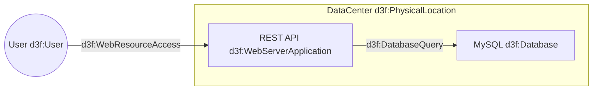
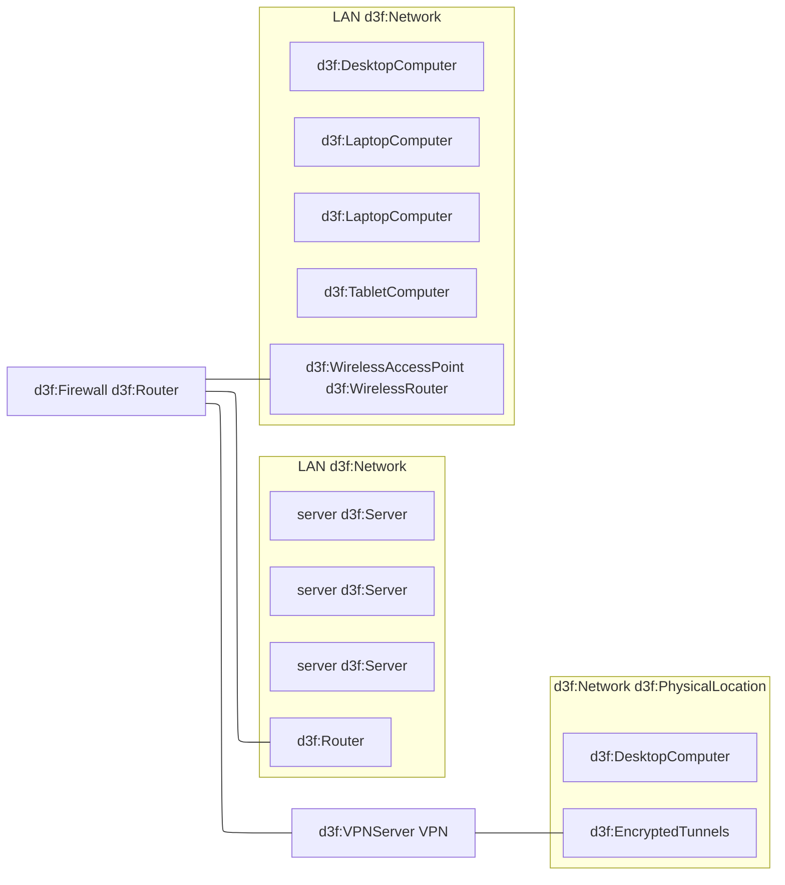

# D3FEND Document

This is a sample document to demonstrate the use of D3FEND Mermaid.

The following diagram provides a high-level architecture of a web application where components are labeled with D3FEND security controls such as `d3f:User`, `d3f:WebServerApplication`, and `d3f:Database`.

# A simple LAN / WAN

You can use different flowchart diagram types (e.g., `graph`, `flowchart-elk`, ...)

