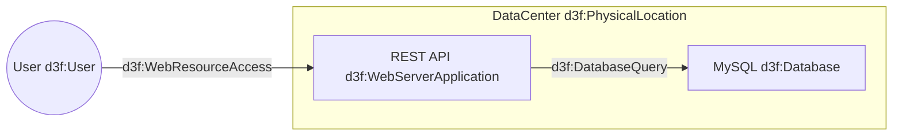

# D3FEND Document

This is a sample document to demonstrate the use of D3FEND Mermaid.

```mermaid
graph LR;
    
u((User d3f:User))
api[REST API d3f:WebServerApplication]
database[MySQL d3f:Database]
u -->|d3f:WebResourceAccess| api
api -->|d3f:DatabaseQuery| database

subgraph DC1[DataCenter d3f:PhysicalLocation]
    api
    database
end

```
