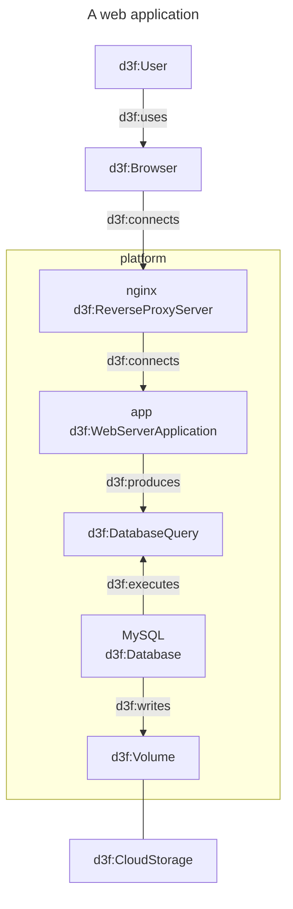

## A web architecture

```mermaid
---
title: A web application
---
graph

user["d3f:User"]
browser["d3f:Browser"]
user -->|d3f:uses| browser

subgraph platform
nginx["nginx d3f:ReverseProxyServer"]
webapp["app d3f:WebServerApplication"]
database["MySQL<br>d3f:Database"]
webapp -->|d3f:produces| query["d3f:DatabaseQuery"]
query ~~~ database -->|d3f:executes| query
database ~~~ query
database -->|d3f:writes| volume

volume["d3f:Volume"]
end

volume --- backup
backup["d3f:CloudStorage"]


browser -->|d3f:connects| nginx
nginx -->|d3f:connects| webapp

```
