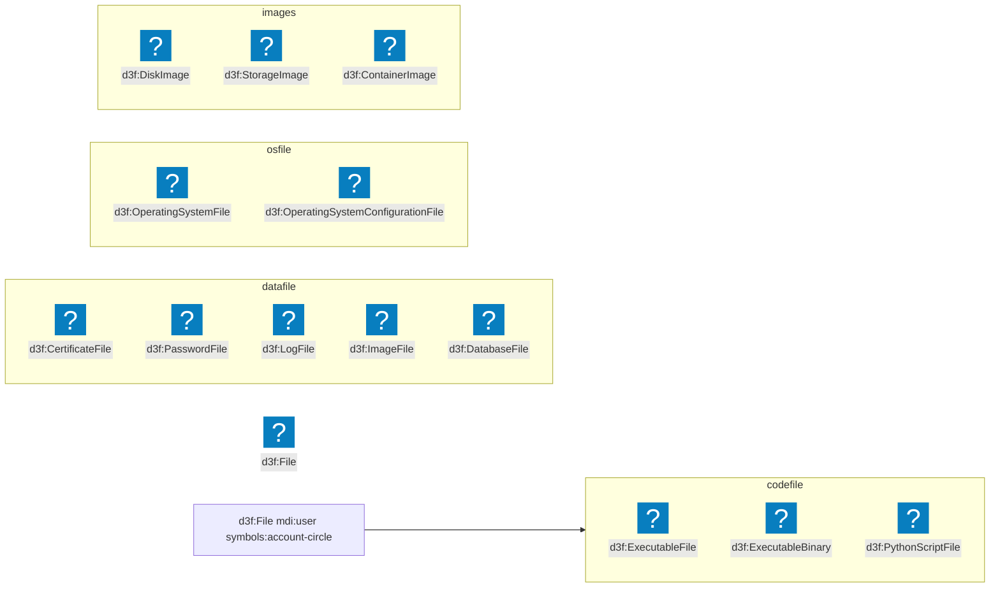

# Files

Design of file-like D3FEND artifacts.

```mermaid
graph LR

File["d3f:File"]@{shape: "card", icon: "mdi:file"}

f["d3f:File mdi:user symbols:account-circle "] --> codefile

subgraph codefile
ExecutableFile["d3f:ExecutableFile"]@{shape: "card", icon: "mdi:file-cog"}
ExecutableBinary["d3f:ExecutableBinary"]@{shape: "card", icon: "mdi:file-cog"}
PythonScriptFile["d3f:PythonScriptFile"]@{shape: "card", icon: "mdi:language-python"}
end

subgraph datafile
CertificateFile["d3f:CertificateFile"]@{shape: "card", icon: "mdi:file-certificate"}
PasswordFile["d3f:PasswordFile"]@{shape: "card", icon: "mdi:file-key"}
LogFile["d3f:LogFile"]@{shape: "card", icon: "mdi:file-document"}
ImageFile["d3f:ImageFile"]@{shape: "card", icon: "mdi:file-image"}
DatabaseFile["d3f:DatabaseFile"]@{shape: "card", icon: "mdi:file-table"}
end


subgraph osfile
OperatingSystemFile["d3f:OperatingSystemFile"]@{shape: "card", icon: "mdi:file-cog"}
OperatingSystemConfigurationFile["d3f:OperatingSystemConfigurationFile"]@{shape: "card", icon: "mdi:file-cog"}
end

subgraph images
DiskImage["d3f:DiskImage"]@{shape: "card", icon: "mdi:harddisk"}
StorageImage["d3f:StorageImage"]@{shape: "card", icon: "mdi:harddisk"}
ContainerImage["d3f:ContainerImage"]@{shape: "card", icon: "mdi:album"}
end
```