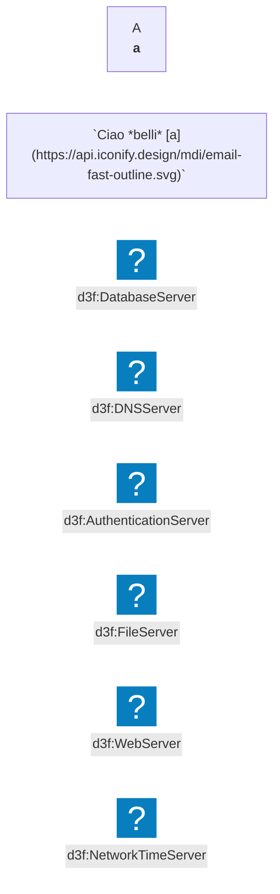
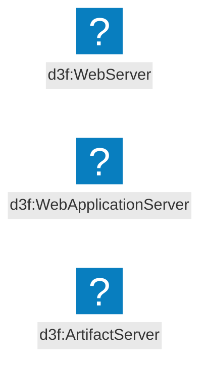
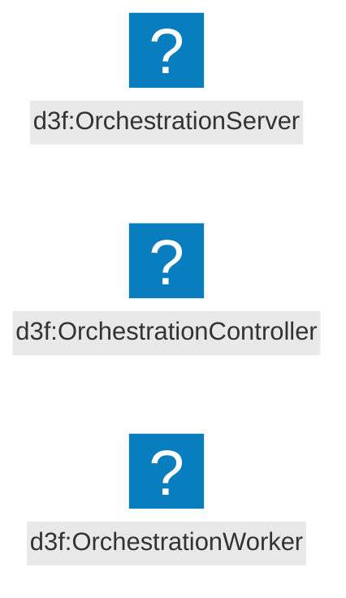
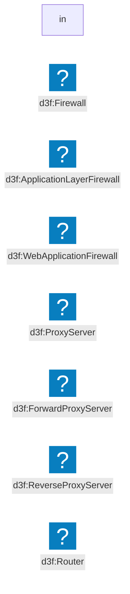
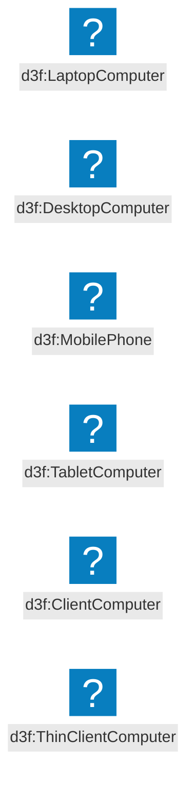

# Hosts

insert an image url

```mermaid
graph LR
z["`Ciao *belli* ![a](https://api.iconify.design/mdi/email-fast-outline.svg)`"]@{label: "A
 **a**
 "}


MailServer@{shape: "process", label: "`Ciao *belli* [a](https://api.iconify.design/mdi/email-fast-outline.svg)`"}
DatabaseServer["d3f:DatabaseServer"]@{shape: "card", icon: "mdi:database"}
DNSServer["d3f:DNSServer"]@{shape: "card", icon: "mdi:dns"}
AuthenticationServer["d3f:AuthenticationServer"]@{shape: "card", icon: "mdi:shield-key"}
FileServer["d3f:FileServer"]@{shape: "card", icon: "mdi:folder-user"}
WebServer["d3f:WebServer"]@{shape: "card", icon: "mdi:web"}
NetworkTimeServer["d3f:NetworkTimeServer"]@{shape: "card", icon: "mdi:clock-time-four-outline"}

```

## Web

```mermaid
graph LR
WebServer["d3f:WebServer"]@{shape: "card", icon: "mdi:web"}

WebApplicationServer["d3f:WebApplicationServer"]@{shape: "card", icon: "mdi:web"}

ArtifactServer["d3f:ArtifactServer"]@{shape: "card", icon: "mdi:package-variant"}

```

## Infra

```mermaid
graph LR

OrchestrationServer["d3f:OrchestrationServer"]@{shape: "card", icon: "mdi:server"}
OrchestrationController["d3f:OrchestrationController"]@{shape: "card", icon: "mdi:server"}
OrchestrationWorker["d3f:OrchestrationWorker"]@{shape: "card", icon: "mdi:server"}
```

## Intermediaries

```mermaid
graph LR
in
Firewall["d3f:Firewall"]@{shape: "diamond", icon: "mdi:firewall"}
ApplicationLayerFirewall["d3f:ApplicationLayerFirewall"]@{shape: "diamond", icon: "mdi:firewall"}
WebApplicationFirewall["d3f:WebApplicationFirewall"]@{shape: "diamond", icon: "mdi:firewall"}


ProxyServer["d3f:ProxyServer"]@{shape: "diamond", icon: "mdi:proxy"}
ForwardProxyServer["d3f:ForwardProxyServer"]@{shape: "diamond", icon: "mdi:proxy"}
ReverseProxyServer["d3f:ReverseProxyServer"]@{shape: "diamond", icon: "mdi:proxy"}

Router["d3f:Router"]@{shape: "diamond", icon: "mdi:router"}
```

# Client Hosts

```mermaid
graph LR

LaptopComputer["d3f:LaptopComputer"]@{shape: "card", icon: "mdi:laptop"}
DesktopComputer["d3f:DesktopComputer"]@{shape: "card", icon: "mdi:desktop-classic"}
MobilePhone["d3f:MobilePhone"]@{shape: "card", icon: "mdi:cellphone"}
TabletComputer["d3f:TabletComputer"]@{shape: "card", icon: "mdi:tablet"}
ClientComputer["d3f:ClientComputer"]@{shape: "card", icon: "mdi:computer"}

ThinClientComputer["d3f:ThinClientComputer"]@{shape: "card", icon: "mdi:monitor-screenshot"}
```
