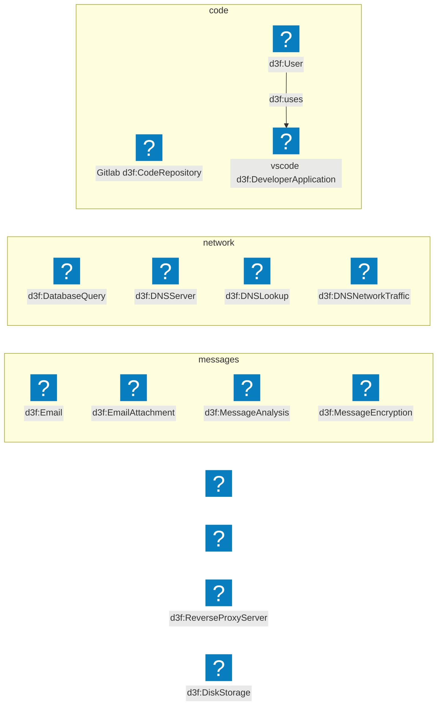

```mermaid
graph LR

q1@{shape: "rounded", icon: "mdi:search-web"}
q2@{shape: "rounded", icon: "mdi:search"}
q2@{shape: "rounded", icon: "mdi:search"}

subgraph messages
Email["d3f:Email"]@{shape: "rounded", icon: "mdi:email"}
EmailAttachment["d3f:EmailAttachment"]@{shape: "rounded", icon: "material-symbols:attach-email"}
MessageAnalysis["d3f:MessageAnalysis"]@{shape: "rounded", icon: "mdi:antivirus"}
MessageEncryption["d3f:MessageEncryption"]@{shape: "rounded", icon: "material-symbols:mail-lock"}
end

subgraph network
DatabaseQuery["d3f:DatabaseQuery"]@{shape: "cylinder", icon: "mdi:sql-query"}
dns["d3f:DNSServer"]@{shape: "cylinder", icon: "mdi:dns"}
DNSLookup["d3f:DNSLookup"]@{shape: "cylinder", icon: "mdi:search-web"}
DNSNetworkTraffic["d3f:DNSNetworkTraffic"]@{shape: "cylinder", icon: "mdi:search-web"}

end

subgraph code

CodeRepository["Gitlab d3f:CodeRepository"]@{shape: "cylinder", icon: "mdi:git"}
dev["d3f:User"]@{icon: "mdi:account"}
dev -->|d3f:uses| vscode["vscode d3f:DeveloperApplication"]@{icon: "mdi:visual-studio-code"}
end
ReverseProxyServer["d3f:ReverseProxyServer"]@{shape: "cylinder", icon: "mdi:proxy"}

disk["d3f:DiskStorage"]@{shape: "cylinder", icon: "carbon:bucket"}
```