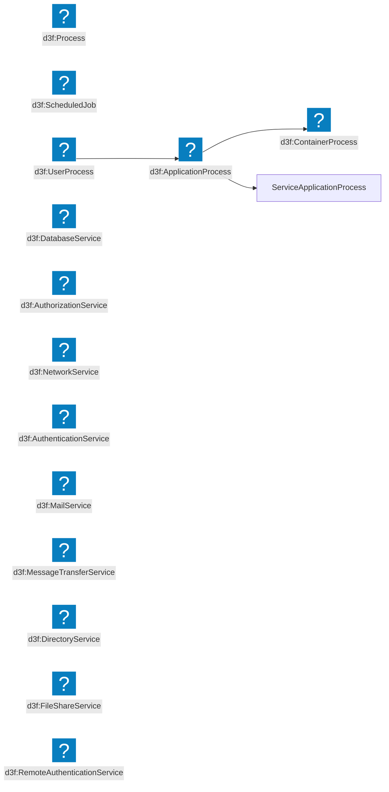

# Processes

Design of D3FEND artifacts.

```mermaid
graph LR

Process["d3f:Process"]@{shape: "process", icon: "mdi:process"}

ScheduledJob["d3f:ScheduledJob"]@{shape: "process", icon: "mdi:calendar-clock"}

UserProcess["d3f:UserProcess"]@{shape: "process", icon: "mdi:account"}

UserProcess --> ApplicationProcess --> ContainerProcess & ServiceApplicationProcess

ApplicationProcess["d3f:ApplicationProcess"]@{shape: "process", icon: "mdi:application"}

ContainerProcess["d3f:ContainerProcess"]@{shape: "process", icon: "mdi:docker"}

DatabaseService["d3f:DatabaseService"]@{shape: "process", icon: "mdi:database"}

AuthorizationService["d3f:AuthorizationService"]@{shape: "process", icon: "mdi:shield-key"}
NetworkService["d3f:NetworkService"]@{shape: "process", icon: "mdi:network"}
AuthenticationService["d3f:AuthenticationService"]@{shape: "process", icon: "mdi:shield-key"}


MailService["d3f:MailService"]@{shape: "process", icon: "mdi:email-fast"}
MessageTransferService["d3f:MessageTransferService"]@{shape: "process", icon: "mdi:email-fast"}
DirectoryService["d3f:DirectoryService"]@{shape: "process", icon: "mdi:account-group"}
FileShareService["d3f:FileShareService"]@{shape: "process", icon: "mdi:folder-shared"}
RemoteAuthenticationService["d3f:RemoteAuthenticationService"]@{shape: "process", icon: "mdi:shield-key"}

```